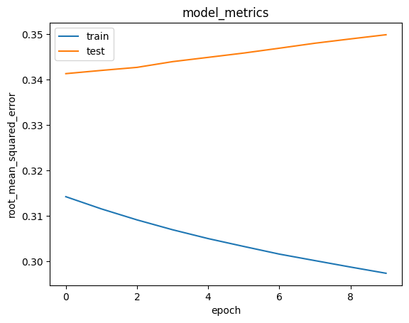

# Laporan Proyek Machine Learning - Nama Anda

## Project Overview

Semakin pesatnya kemajuan teknologi mengubah cara manusia mengakses konten literatur. Dulu, orang-orang harus pergi ke perpustakaan atau toko buku untuk membaca buku. Sekarang, orang-orang bisa membaca buku secara online melalui perangkat elektronik seperti smartphone, tablet, atau laptop. Tentunya hal ini membuka peluang industri baru yaitu industri toko buku digital. Akan tetapi menjadi tantangan tersendiri bagi industri ini untuk menyajikan buku-buku yang sesuai dengan minat pengguna. Maka dari itu, dibutuhkan sistem rekomendasi yang dapat merekomendasikan buku-buku yang sesuai dengan minat pengguna. Dengan menggunakan collaborative filtering, sistem rekomendasi dapat merekomendasikan buku-buku yang sesuai dengan minat pengguna berdasarkan buku-buku yang telah dibaca oleh pengguna tersebut.

## Business Understanding

Dalam industri perpustakaan digital, pemahaman terhadap preferensi pelanggan sangat penting. Dengan memahami preferensi pelanggan maka dapat menaikkan tingkat kunjungan ke toko dan meningkatkan tingkat penjualan. Maka dari itu dibutuhkan sistem rekomendasi yang dapat merekomendasikan buku-buku yang sesuai dengan minat pelanggan.

### Problem Statements

- Faktor apa yang dapat digunakan untuk merekomendasikan buku yang sesuai dengan minat pengguna?
- Buku apa yang direkomendsikan untuk pengguna berdasarkan buku yang telah dirating oleh pengguna sebelumnya?

### Goals

- Mengetahui faktor yang dapat digunakan untuk merekomendasikan buku yang sesuai dengan minat pengguna.
- Membuat sistem rekomendasi yang dapat merekomendasikan buku yang sesuai dengan minat pengguna berdasarkan buku yang telah dirating oleh pengguna sebelumnya.

## Data Understanding

Data merupakan kumpulan judul buku, user, dan rating yang diberikan oleh user terhadap buku. Data yang digunakan berasal dari [Kaggle](https://www.kaggle.com/datasets/arashnic/book-recommendation-dataset). Data dikumpulkan selama 4 Minggu dari Agustus 2004 hingga September 2004. Data yang digunakan merupakan data yang bersifat public dan dapat diakses oleh siapa saja. Data yang digunakan merupakan data yang bersifat explicit. Data yang digunakan terdiri dari tiga file, yaitu Books.csv, Ratings.csv, dan Users.csv. Berikut adalah penjelasan mengenai ketiga file tersebut:

- Books.csv: Berisi informasi mengenai buku yang terdiri dari 8 kolom, yaitu ISBN, Book-Title, Book-Author, Year-Of-Publication, Publisher, Image-URL-S, Image-URL-M, dan Image-URL-L. File ini memiliki 271.360 baris. Seluruh nilai pada data bersifat objek string.
- Ratings.csv: Berisi informasi mengenai rating yang diberikan oleh user terhadap buku yang terdiri dari 3 kolom, yaitu User-ID, ISBN, dan Book-Rating. File ini memiliki 1.149.780 baris. Nilai pada kolom ISBN bersifat objek string dan pada User-ID dan Book-Rating bersifat integer.
- Users.csv: Berisi informasi mengenai user yang terdiri dari 3 kolom, yaitu User-ID, Location, dan Age. File ini memiliki 278.858 baris. Nilai pada User-ID bertipe integer, Location bertipe object string, dan Age bertipe float.

**Variabel-variabel pada dataset adalah sebagai berikut:**
- ISBN : merupakan kode pada buku, memiliki nilai berbeda tiap judul buku.
- Book-Title : berisi judul dari buku.
- Book-Author : berisi nama pengarang dari buku.
- Year-Of-Publication : berisi tahun penerbitan buku.
- Publisher : berisi nama penerbit buku.
- Image-URL-S : berisi link gambar sampul buku dengan ukuran kecil.
- Image-URL-M : berisi link gambar sampul buku dengan ukuran sedang.
- Image-URL-L : berisi link gambar sampul buku dengan ukuran besar.
- User-ID : merupakan kode pada user, memiliki nilai berbeda tiap user.
- Location : berisi lokasi dari user.
- Age : berisi usia dari user.
- Book-Rating : berisi rating yang diberikan oleh user terhadap buku.

**Eksporasi Data**
- Melihat jumlah data unik dari tiga file data, didapatkan hasil sebagai berikut:
    - Books.csv
        - ISBN : 271.360
        - Book-Title : 242.135
        - Book-Author : 102.023
        - Year-Of-Publication : 2021
        - Publisher : 16.606
        - Image-URL-S : 271.360
        - Image-URL-M : 271.360
        - Image-URL-L : 271.360
    - Ratings.csv
        - User-ID : 105.283
        - ISBN : 340.556
        - Book-Rating : 11
    - Users.csv
        - User-ID : 278.858
        - Location : 56.839
        - Age : 165
- Cek deskripsi statistik data untuk melihat jumlah data non-null tiap kolom dan tipe data.
- Melihat dataframe secara langsung dari ketiga file data
- Cek nilai maksimum dan minimum pada kolom Book-Rating

## Data Preparation

- Melakukan copy dataframe ratings agar tidak merusak data asli dengan melakukan inisialisasi ke variabel `df`.
- Mengubah nilai pada kolom Book-Rating menjadi float dengan fungsi `astype()`. Hal ini dibutuhkan karena untuk normalisasi nanti akan menggunakan nilai float.
- Mengubah nilai pada kolom User-ID pada dataframe df menjadi list tanpa nilai yang sama. Untuk melakukan ini menggunakan fungsi `unique()` dan `tolist()`. Hal ini dilakukan untuk persiapan proses encoding selanjutnya.
- Melakukan encoding pada kolom User-ID dengan memanfaatkan fungsi `enumerate()`. Hal ini dilakukan untuk mencari data selalu konsisten pada saat training nanti.
- Encoding angka pada kolom User-ID dengan memanfaatkan fungsi `enumerate()`. Hal ini dilakukan untuk fase prediksi nanti.
- Mengubah nilai pada kolom ISBN pada dataframe df menjadi list tanpa nilai yang sama. Untuk melakukan ini menggunakan fungsi `unique()` dan `tolist()`. Hal ini dilakukan untuk persiapan proses encoding selanjutnya.
- Melakukan encoding pada kolom ISBN dengan memanfaatkan fungsi `enumerate()`. Hal ini dilakukan untuk mencari data selalu konsisten pada saat training nanti.
- Encoding angka pada kolom ISBN dengan memanfaatkan fungsi `enumerate()`. Hal ini dilakukan untuk fase prediksi nanti.
- Melakukan mapping ke dataframe df dengan menambahkan kolom user dan book yang nilainya diambil masing2 dari User-ID dan ISBN yang sudah dilakukan encoding. Untuk melakukan ini memanfaatkan fungsi `map()`. Kedua kolom ini akan digunakan sebagai data train nanti.
- Mengacak isi dari dataframe df dengan memanfaatkan fungsi `sample()`. Hal ini dilakukan untuk mengurangi waktu proses training model.
- Mapping kembali pada kolom User-ID dan ISBN ke dataframe df dengan memanfaatkan fungsi `map()`. Kedua kolom ini akan digunakan sebagai data test nanti.
- Membagi data menjadi data train dan data test untuk proses training dan validasi model.
- Ambil nilai pada kolom user dan book kemudian diinisialisasi pada dataframe baru dengan nama `X`. Dataframe ini berisi data yang akan ditrain dan ditest.
- Ambil nilai pada kolom rating kemudian diinisialisasi pada dataframe baru dengan nama `y`. Dataframe ini berisi label pada data yang akan ditrain dan ditest.
- Melakukan scaling pada nilai/label `y` dengan MinMaxScaler. Hal ini dilakukan untuk mempercepat proses training dan meningkatkan akurasi model.
- Data kemudian dibagi menjadi data train dan data test dengan rasio 80:20. Pembagian data dengan rasio ini ini dilakukan untuk menghindari overfitting dan underfitting, selain itu berguna juga untuk mengukur tingkat keberhasilan model dalam prediksi.

## Modeling

Model yang digunakan adalah Collaborative Filtering. Collaborative Filtering merupakan teknik yang digunakan untuk merekomendasikan item berdasarkan informasi dari pengguna lain. Collaborative Filtering dapat dibagi menjadi dua, yaitu User-based Collaborative Filtering dan Item-based Collaborative Filtering. User-based Collaborative Filtering merekomendasikan item berdasarkan kesamaan antar pengguna. Item-based Collaborative Filtering merekomendasikan item berdasarkan kesamaan antar item. Pada proyek ini, digunakan User-based Collaborative Filtering. Kelebihan dari User-based Collaborative Filtering adalah mudah untuk diimplementasikan, sangat terpersonalisasi kepada pengguna, dan dapat memberikan rekomendasi yang tidak terduga dengan menghubungkan pengguna dengan pengguna lain yang mempunyai preferensi serupa. Kelemahan dari User-based Collaborative Filtering adalah tidak dapat merekomendasikan item yang tidak pernah diberikan rating oleh pengguna lain, selain itu kesulitan untuk menangani cold start problem.

Untuk membuat model memanfaatkan keras Model class, kelas diberi nama RecommenderNet. Kelas terinspirasi dari [tutorial ini](https://keras.io/examples/structured_data/collaborative_filtering_movielens/) dengan beberapa penyesuaian terhadap kasus yang ingin diselesaikan. Didalam kelas ini memanggil 4 layer, yaitu user embedding, book embedding, user bias, dan book bias. User bias dan book bias merupakan layer yang menambah nilai bias untuk setiap user dan book. User embedding dan book embedding merupakan embedding layer yang mengubah nilai dari kolom user dan book menjadi vektor. Vektor ini akan digunakan untuk menghitung kesamaan antar user dan antar book. Setelah itu, kedua vektor akan digabungkan menggunakan dot product. Hasil dari dot product ini akan dihitung dengan sigmoid untuk menghasilkan nilai antara 0 dan 1. Nilai ini akan digunakan sebagai prediksi rating yang diberikan oleh user terhadap buku.

Parameter yang digunakan untuk membuat model adalah sebagai berikut:
- `num_user`: Jumlah user yang ada pada data.
- `num_book`: Jumlah buku yang ada pada data.
- `embedding_size`: Jumlah faktor yang digunakan untuk embedding layer.

Kemudian model di-compile dengan loss function binary crossentropy dan optimizer adam dengan `learning rate = 0.001`. Loss function binary crossentropy digunakan karena output yang dihasilkan berupa nilai antara 0 dan 1. Optimizer adam digunakan karena optimizer ini merupakan optimizer yang paling sering digunakan dan memiliki performa yang baik. Metrik evaluasi yang digunakan adalah root mean squared error (RMSE) karena merupakan metrik evaluasi yang sering digunakan untuk collaborative filtering.

Model ditraining dengan data train dan data test yang sudah dibagi sebelumnya. Model ditraining dengan batch size 8 dan epoch 10. Batch size 8 digunakan untuk meningkatkan akurasi. Epoch 10 digunakan karena setelah epoch 10, model tidak mengalami peningkatan performa yang signifikan.

Lalu setelah model ditraining, dilakukan prediksi dengan mengambil user id secara random dari data Ratings.csv. Kemudian dilakukan prediksi rating yang diberikan oleh user random tersebut terhadap buku random. Setelah itu, dilakukan prediksi rating yang diberikan oleh user random tersebut terhadap seluruh buku yang ada pada data. Kemudian, dilakukan sorting untuk mendapatkan 10 buku dengan prediksi rating tertinggi. Hasil prediksi dapat dilihat pada tabel berikut:

| User-ID |    ISBN    | Rekomendasi Buku                                  | 
|:-------:|:----------:|:--------------------------------------------------|
|  98391  | 0671468464 | King Lear                                         |  
|  98391  | 0670870897 | Without a Doubt                                   |  
|  98391  | 0712345337 | The Original Alice: From Manuscript to Wonderland |  
|  98391  | 0312204272 | The Museum Guard: A Novel                         |  
|  98391  | 3257232624 | Oberchaoten.                                      |  
|  98391  | 0889842078 | Abby Malone                                       |  
|  98391  | 0764551809 | Nutrition for Dummies                             |  
|  98391  | 0375703365 | Train Whistle Guitar                              |  
|  98391  | 1583225676 | The Nanny and the Iceberg                         |  
|  98391  | 0465090443 | Vital Dust: Life As a Cosmic Imperative           |  

## Evaluation
Metrik evaluasi yang digunakan adalah root mean squared error (RMSE). RMSE merupakan metrik evaluasi yang sering digunakan untuk collaborative filtering. RMSE mengukur seberapa dekat prediksi dengan nilai aktual. RMSE merupakan akar dari MSE.

Formula RMSE adalah sebagai berikut:

$$RMSE = \sqrt{\frac{1}{n}\sum_{i=1}^{n}(y_i - \hat{y_i})^2}$$

$$y_i = nilai\ aktual$$

$$\hat{y_i} = nilai\ prediksi$$

Dapat dilihat dari visualisasi berikut nilai RMSE model pada data train semakin kecil dan data test semakin membuat plateau.

  

